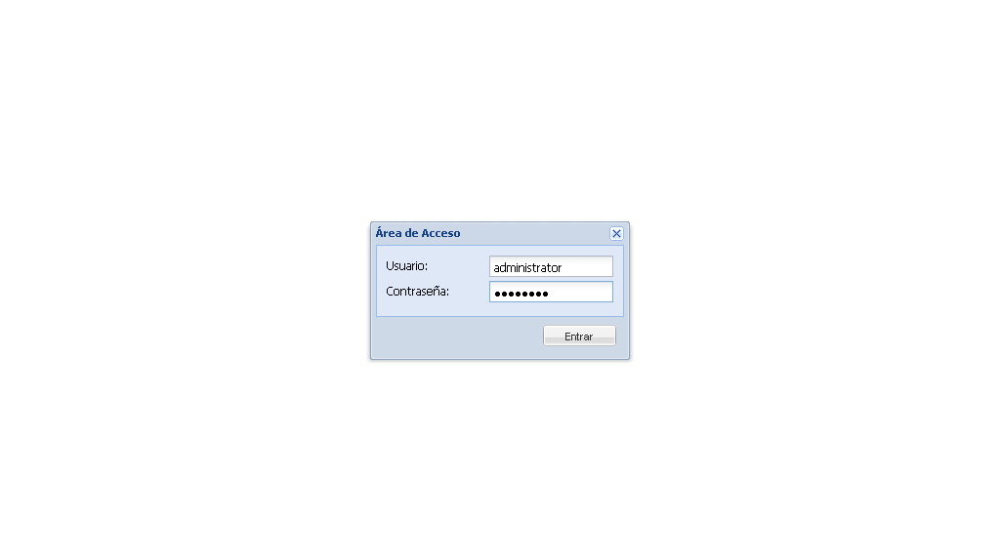

# ADSBrowser is a Python frontend for Samba 4

ADSBrowser provides a graphical user interface (GUI) for managing Active Directory (AD) objects
and services. It is used to manage AD domains, trees, and forests, as well
as individual objects like users, groups, computers, 
and organizational units (OUs). 

With ADSBrowser, administrators can perform a wide range of tasks, 
including creating, modifying, and deleting objects; and diagnosing and resolving issues. 
The tool also provides a search function that allows administrators to
quickly find specific objects in the AD database.




> This tool aims to be a clone of dsa.msc

## Dependencies

- Samba4 (in particular, the Samba 4 Python bindings)
- pylons
- pam
- cjson
- jsonpickle

## Installation

On debian:

```bash
apt-get install python-pam python-cjson python-jsonpickle python-pylons
```

adding the following to the *[global]* section of the smb.conf file:

```conf
server services = +smb -s3fs
dcerpc endpoint servers = +winreg +srvsvc
```

## Standalone

```bash
git clone https://github.com/rnapoles/ADSBrowser.git
cd ADSBrowser/
```

#### Add the python binding for samba4

Example:
```bash
export PYTHONPATH=$PYTHONPATH:/usr/local/samba/lib/python2.6/site-packages/
export PATH=$PATH:/usr/local/samba/bin/:/usr/local/samba/sbin/
```

#### Use paster:
```bash
paster serve --reload development.ini &
```

This will initiate the Server at http://localhost:5001. 
You must authenticate with **root** for provision or with 
a valid Samba account for manage AD. Authentication will be performed 
using RPC, SAMR or PAM. 

#### Open the browser and put: 
```
http://server-ip:5001/
```

## Todo
- [x] List ADS objects
- [x] Allow move ADS objects
- [x] Allow delete ADS objects
- [x] Enable-Disable users
- [x] Reset users password
- [ ] Allow create users
- [ ] Allow create groups
- [ ] Add property sheet editor
- [ ] Manage group policies;
- [ ] Configure replication
- [ ] Migrate to Flask REST API
- [ ] Rewrite using a Clean Architecture
